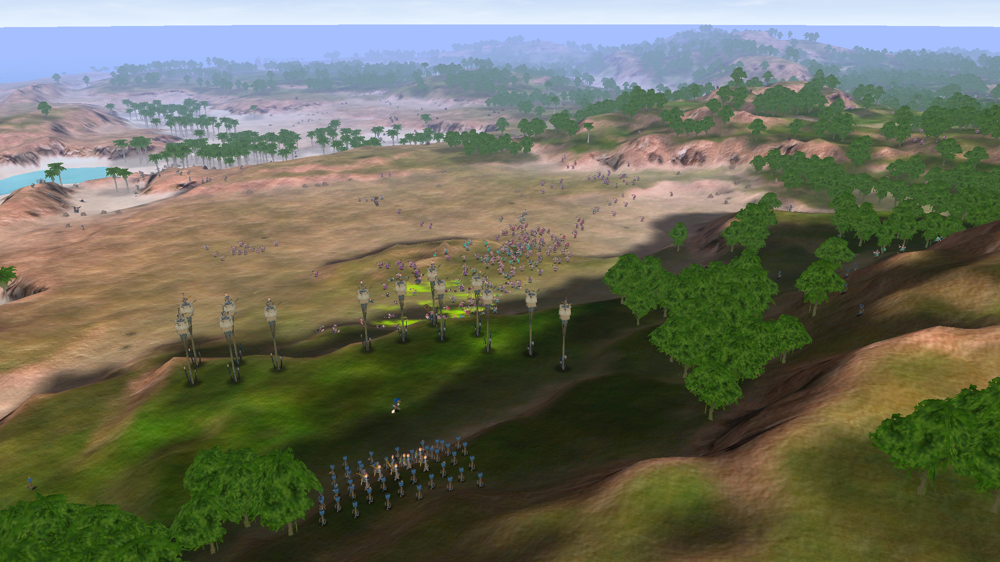

## Team Penguin's progress:

- [x] Matchmaking, Routing and Registration.
- [x] Game play with (8) Players on a Huge Island.
- [x] Gentoo Ebuild created: [games-misc/tribaltrouble](portage/PORTAGE.md)
- [x] Windows package with Huge/8 Team support: [Tribal_Trouble.zip](wbin/Tribal_Trouble.zip)
- [Instructions](wbin/TT.md)

### Server setup documentation

- [DNS](dns/DNS.md)
- [MySQL](mysql/MYSQL.md)
- [Registration](registration-files/REGISTRATION.md)
- [Apache Tomcat 6](apache-tomcat/TOMCAT.md)


*The Horde is attacking*


Tribal Trouble
==============
Tribal Trouble is a realtime strategy game released by Oddlabs in 2004. In 2014 the source was released under GPL2 license, and can be found in this repository.

The source is released "as is", and Oddlabs will not be available for help building it, modifying it or any other kind of support. Due to the age of the game, it is reasonable to expect there to be some problems on some systems. Oddlabs has not released updates to the game for years, and do not intend to start updating it now that it is open sourced.

**If** you know how to code Java, configure ant, use MySQL, and have a **genuine intention** of actually working on the game, you can create an issue for detailed questions about the source.

Binaries
--------
If you are simply looking for a working binary version of the game, you can find the latest released installers here:

- [Windows](https://github.com/sunenielsen/tribaltrouble/blob/master/binaries/TribalTroubleSetup.exe)
- [Mac](https://github.com/sunenielsen/tribaltrouble/blob/master/binaries/TribalTrouble.dmg)
- [Linux](https://github.com/sunenielsen/tribaltrouble/blob/master/binaries/TribalTroubleSetup.sh)

Please note that the multiplayer server referenced in these builds, is no longer available.

You can register the binaries by putting the [registration](https://github.com/sunenielsen/tribaltrouble/blob/master/binaries/registration) file into this folder:
- Windows XP: `C:\Documents and Settings\Username\TribalTrouble\`
- Windows Vista or newer: `C:\Users\Username\TribalTrouble\`
- Mac OS X: `Library/Application Support/TribalTrouble/`
- Linux: `~/.TribalTrouble/`


Building
--------
Clone the repository:
```
git clone https://github.com/sunenielsen/tribaltrouble.git
```
Make sure you have Java SDK at least version 6, and Apache Ant.


To build the game client, do this:
```
cd tt
ant run
```

Setting up a server is a lot more complex, and not something we have done in many years. It will take some work to get it working, but try looking at the server folder and see if you can figure it out. At the very least, you should know a bit about setting up a MySQL server.
